# OpenShift Virtualization DR & Mobility

This repo showcases  **several ways to protect and move a running Application/VM between OpenShift Enviroments** — from live
migration to asynchronous DR to backup-and-restore and Application Failover based on Red Hat Service Interconnect:

| # | Use case | Mechanism | Recovery type |
|---|----------|-----------|---------------|
| 1 | **[Regional DR Failover](#use-case-1-test-regional-dr-failover)** | ODF Regional-DR (Ramen + VolSync) driven by an ACM `DRPlacementControl` | Disaster recovery — VM is **restarted** on the surviving cluster from replicated storage |
| 2 | **[Cross-Cluster Live Migration](#use-case-2-test-cross-cluster-live-migration-cclm-with-submariner)** | KubeVirt **decentralized live migration** over a **Submariner** pod network | Live mobility — VM **keeps running** while its memory + disk move to the other cluster |
| 3 | **[VolSync Direct DR](#use-case-3-lightweight-regionalasynchronous-dr-with-volsync-direct-cluster-to-cluster-without-the-need-for-odf)** | VolSync `ReplicationSource`/`ReplicationDestination` (`rsync-tls` mover) replicating PVCs **directly cluster-to-cluster** — no ODF Ramen / MirrorPeer / DRPolicy | Lightweight disaster recovery — promote the replicated snapshot on the standby |
| 4 | **[OADP Backup & Recovery](#use-case-4-oadp-backup--recovery-to-object-storage)** | **OADP** (Velero) CSI snapshot + data mover to an **S3 bucket**, plus ACM policies that schedule **label-driven** 5-min backups (Velero `Schedule`, 1h TTL) and **auto-restore the VM on the peer** if it goes away for 30s | Backup/restore — back a VM up (on-demand or scheduled), **recover it on another** cluster, automatically on failure |
| 5 | **[CNPG cross-site Postgres over Service Interconnect](#use-case-5-cnpg-cross-site-postgres-over-red-hat-service-interconnect)** | **CloudNativePG** primary/replica split across the two spokes, with **Red Hat Service Interconnect** (Skupper v2) carrying the streaming replication + app write path, wired by ACM policies | Active/active reads + single-writer DR — flip a `pg-role` label and ACM performs a **zero-data-loss CNPG controlled switchover** (read/write moves to the other site) |

Everything runs inside a Podman container (no local Ansible needed) via `./ansible-runner.sh`.

## Topology

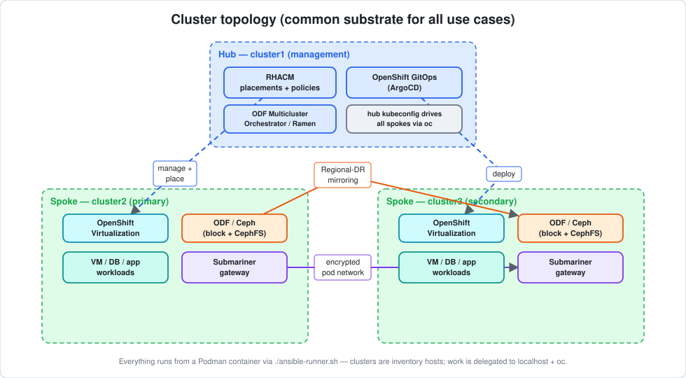

> The diagrams in this README are `.drawio.svg` files — they render here on GitHub **and** open directly in
> [diagrams.net](https://app.diagrams.net) for editing. Regenerate them with
> `python3 docs/diagrams/gen_diagrams.py` (source specs in [`docs/diagrams/gen_diagrams.py`](docs/diagrams/gen_diagrams.py)).

- **Hub = cluster1**, **spokes = cluster2 / cluster3** (all AWS IPI, `us-east-2`, OpenShift **4.22.5**).
- CIDRs are non-overlapping so Submariner routes pod-to-pod without globalnet: cluster2 pod
  `10.128.0.0/14` / svc `172.30.0.0/16`, cluster3 pod `10.132.0.0/14` / svc `172.31.0.0/16`.
- Each cluster uses a separate AWS account via a named profile in `~/.aws/credentials`
  (set as `aws_profile` in `inventory/host_vars/<cluster>`).
- **The two spokes are installed with non-overlapping CIDRs** so Submariner runs **without
  globalnet** and routes pod-to-pod directly — a hard requirement for use case 2 (see below).

---

## Prerequisites

1. **Podman** on the host.
2. **`~/.aws/credentials`** with one named profile per cluster account, each with EC2/VPC/ELB/Route53/IAM permissions:
   ```ini
   [cluster1]
   aws_access_key_id = ...
   aws_secret_access_key = ...
   [cluster2]
   ...
   [cluster3]
   ...
   ```
   The profile each cluster uses is set by `aws_profile` in its `inventory/host_vars/` file.
3. **`pull-secret.json`** (Red Hat pull secret) and **`ssh-key.pub`** in the repo root.
4. A **public Route53 hosted zone** in each account (base domain is auto-detected).

Validate everything before deploying:

```bash
./ansible-runner.sh validate
```

---

## Common setup (shared by every use case)

The first four commands are the substrate every use case builds on. **Each use case below also lists
its own complete command chain**, so you can jump straight to the one you want — this section is the
part they all share. Total time ~2–3 h (three AWS cluster installs + operators + ODF + metal nodes).

```bash
./ansible-runner.sh deploy       # 1. Install cluster1/2/3 on OpenShift 4.22.5 (IPI)
./ansible-runner.sh operators    # 2. ACM + ODF MCO + Ramen-hub (hub); DR-cluster + OADP (spokes)
./ansible-runner.sh import       # 3. Import spokes into ACM as ManagedClusters
./ansible-runner.sh infra-dr     # 4. ODF StorageCluster on spokes (needed by all) + Submariner (only use case 2)
./ansible-runner.sh certs        # 5. cert-manager + Let's Encrypt wildcard certs on every ingress
```

> **Why `certs` matters for DR:** Ramen validates each `DRCluster` by reaching its ODF/Noobaa
> S3 endpoint over TLS. The `certs` step gives every `*.apps.<domain>` route (including the S3
> route) a publicly-trusted Let's Encrypt certificate, so `DRCluster … Validated=True` without
> any custom-CA trust plumbing. Skip it and Regional-DR replication stalls on TLS.

> **What `infra-dr` bundles:** it creates the **ODF StorageCluster** on the spokes — a hard
> prerequisite for *every* use case, since the VMs and app PVCs bind `ocs-storagecluster-ceph-rbd*`
> and this is the only step that creates it — and it enables **Submariner**, which is only actually
> used by **use case 2 (CCLM)**. It stays in the common setup for the ODF part; the Submariner part is
> simply unused (not harmful) for the other use cases.

Confirm the DR control plane is healthy:

```bash
oc --kubeconfig artifacts/cluster1/kubeconfig get drpolicy,drcluster
# dr-policy   Validated=True ;  cluster2/cluster3  Validated=True
```

Then deploy OpenShift Virtualization and a VM on the spokes:

```bash
./ansible-runner.sh virt         # CNV on both spokes (on m5.metal nodes) + hub + DR-protected VM
```

`virt` provisions an `m5.metal` MachineSet on each spoke (bare metal is required for hardware
virtualization on AWS), installs CNV via an ACM policy, and deploys a DR-protected VM
`vm-dr-example` in namespace `vm-example`. It also installs the CNV operator on the **hub**
directly (`virt_deploy_hub: true`); the hub gets no bare-metal MachineSet, so its CNV control
plane installs and reconciles but cannot schedule VMs until the hub has KVM-capable nodes. Set
`virt_deploy_hub: false` to skip the hub install.

---

## Use case 1: Test Regional DR Failover

**Stand it up** — every command this use case needs, in order:

```bash
./ansible-runner.sh deploy       # cluster1/2/3 on AWS
./ansible-runner.sh operators    # ACM + ODF MCO + Ramen-hub (hub); DR-cluster + OADP (spokes)
./ansible-runner.sh import       # spokes into ACM as ManagedClusters
./ansible-runner.sh infra-dr     # ODF StorageCluster on the spokes (+ Submariner)
./ansible-runner.sh certs        # Let's Encrypt certs — Ramen validates each DRCluster's S3 over TLS
./ansible-runner.sh app          # MirrorPeer + DRPolicy + the GitOps wiring (GitOpsCluster)
./ansible-runner.sh virt         # metal nodes + OpenShift Virtualization + the DR-protected VM
```

`app` **must precede** `virt`: `virt`'s last two plays need the `DRPolicy` and GitOps that `app` creates
— without them they skip, and you get virtualization nodes but no protected VM.

**Choosing how the sample app is deployed.** `app` ships the same Quarkus + MySQL application two
ways, selected with `app_deployment_mode`:

| Mode | Deploys | DR-protected |
|------|---------|--------------|
| `gitops` *(default)* | ArgoCD `ApplicationSet` pushes it to the DR cluster — the flow this README walks through | yes |
| `direct` | the same manifests applied with `oc apply`, no GitOps in the picture | yes (it is the only instance) |
| `both` | both, in separate namespaces | GitOps only, unless `-e app_protect_direct_instance=true` |

```bash
./ansible-runner.sh app                              # gitops (default)
./ansible-runner.sh app -e app_deployment_mode=direct
```

> **Why `both` protects only one by default:** two DR-protected instances of the same app on one
> storage class collide on ODF versions that group PVCs into consistency groups. The group id is
> derived from the **storage class, not the application**, so both PVCs land in the same RBD group —
> and an RBD image may belong to only one group. The second `VolumeGroupReplication` fails in Ceph
> with `rbd: ret=-22, Invalid argument`, that DRPC never leaves `Protected=False`, and the ODF DR
> dashboard shows the app critical. There is no Kubernetes-level fix, and clearing it in Ceph is
> worse: the group is **mirrored**, so deleting it on the primary breaks the peer's promote
> (`failed to get volume group by id …`) and strands an in-flight failover. Found live 2026-07-30.

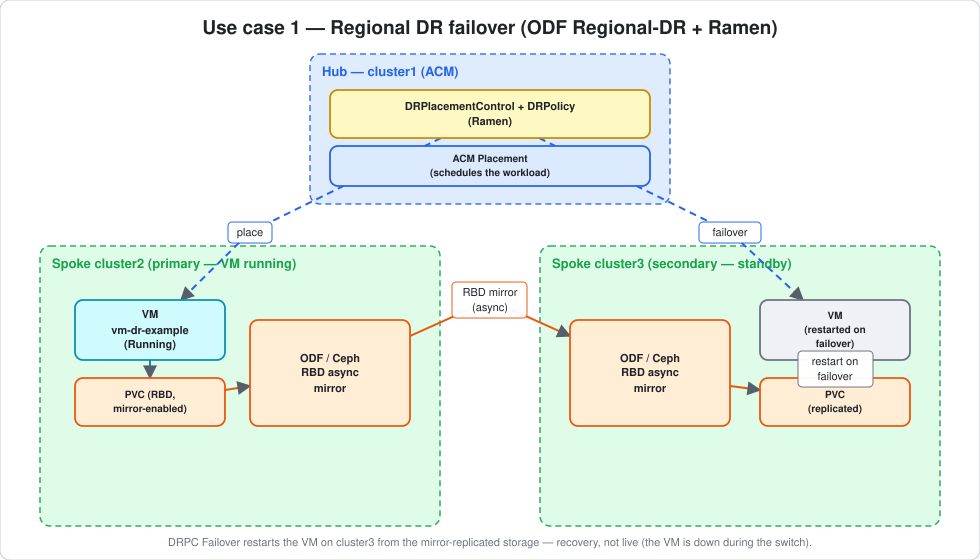

A DR-protected VM (`vm-dr-example`) runs on **cluster2**. Its disk is mirrored to **cluster3**
by ODF/VolSync, and an ACM `DRPlacementControl` (DRPC) governs where it runs. On a "regional
outage" you **fail it over** and Ramen restarts it on cluster3 from the replicated volume.

### ACM policies

This use case adds **none of its own** — placement and failover are the Ramen `DRPlacementControl`,
not a policy, and the DR operators are installed directly by `operators`. The policies it inherits
from the common setup are:

| Policy | Runs on | Does |
|--------|---------|------|
| `cnv-operator-policy` | spokes | Installs OpenShift Virtualization and reconciles the `HyperConverged`, so the spokes can run the protected VM |
| `metal-machineset-policy` | spokes | Creates the `m5.metal` MachineSet that gives each spoke a KVM-capable node |
| `cert-manager-policy` | hub + spokes | Installs cert-manager and issues the Let's Encrypt wildcard cert that lets Ramen validate each `DRCluster` S3 endpoint over TLS |

### 1. Confirm the VM is protected and running on cluster2

In the ACM console (**Fleet management → Search**, `kind:VirtualMachine`) the VM shows on **cluster2, Running**:

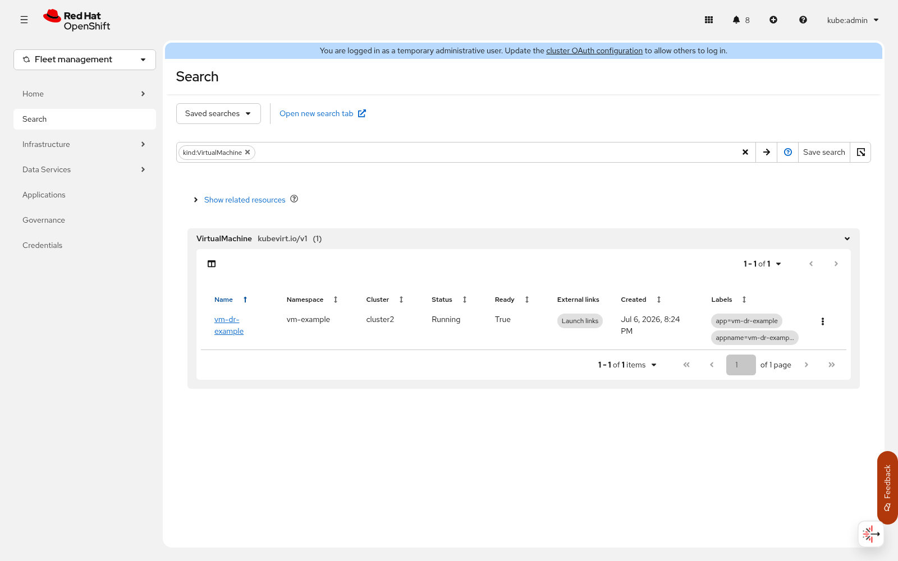

Its DR state should be `Deployed` / `Protected=True` / `PeerReady=True`:

```bash
oc --kubeconfig artifacts/cluster1/kubeconfig \
   get drpc vm-dr-example-gitops-drpc -n openshift-gitops \
   -o jsonpath='{.status.phase} Protected={.status.conditions[?(@.type=="Protected")].status} PeerReady={.status.conditions[?(@.type=="PeerReady")].status}{"\n"}'
# Deployed  Protected=True  PeerReady=True
```

### 2. Fail over (or relocate) from the ACM console

The default way to move a DR-protected application is the RHACM **Fleet management → Applications**
view. The DR-protected app (`vm-dr-example-gitops-appset`) exposes **Failover application** and
**Relocate application** actions directly in its row menu:

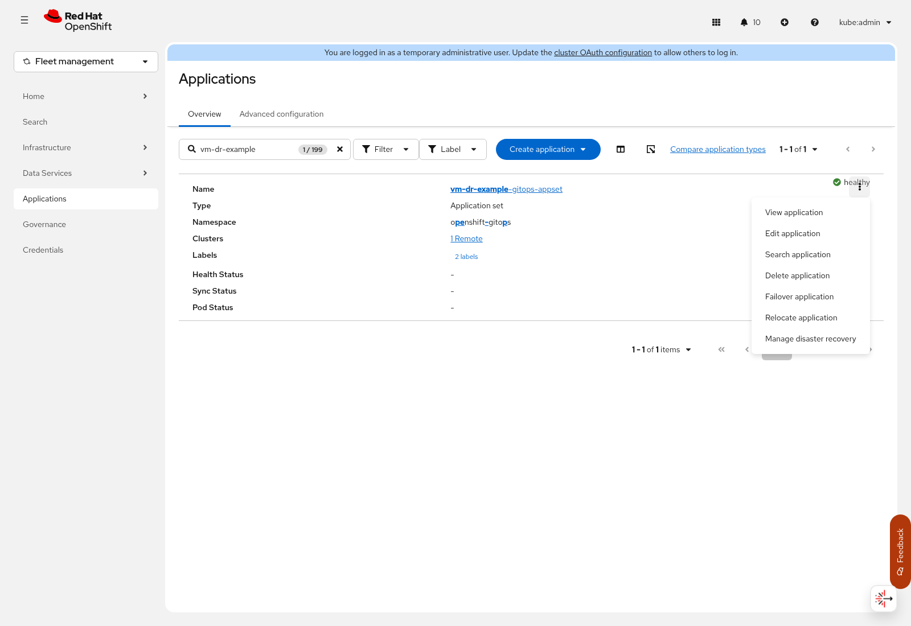

- **Failover application** — for an unplanned outage. Pick the target managed cluster (`cluster3`) in
  the modal; ACM sets the app's `DRPlacementControl` `action: Failover` and Ramen restarts the VM on
  cluster3 from the last replicated volume.
- **Relocate application** — for a planned, orderly move. Available once `PeerReady=True`; ACM sets
  `action: Relocate` to return the app to its preferred cluster (`cluster2`).
- **Manage disaster recovery** — opens the DR status (current placement, last-sync time, DRPolicy).

Watch it progress `FailingOver → FailedOver`, and the VM come up on cluster3:

```bash
watch 'oc --kubeconfig artifacts/cluster1/kubeconfig get drpc vm-dr-example-gitops-drpc -n openshift-gitops -o jsonpath="{.status.phase}"; \
       echo; oc --kubeconfig artifacts/cluster3/kubeconfig get vmi -n vm-example'
```

### 3. Verify the VM restarted on cluster3

ACM Search now shows the **same VM on cluster3, Running** (new instance, later timestamp) — and it is gone from cluster2:


The OpenShift console on cluster3 shows the running VM:


### Alternative: driving it from the CLI

The console actions are just a patch to the `DRPlacementControl` `spec.action`, so you can script the
same failover and fail-back:

```bash
# Fail over to cluster3 (unplanned outage)
oc --kubeconfig artifacts/cluster1/kubeconfig \
   patch drpc vm-dr-example-gitops-drpc -n openshift-gitops --type=merge \
   -p '{"spec":{"action":"Failover","failoverCluster":"cluster3"}}'

# Fail back once PeerReady=True (planned relocate to the preferred cluster)
oc --kubeconfig artifacts/cluster1/kubeconfig \
   patch drpc vm-dr-example-gitops-drpc -n openshift-gitops --type=merge \
   -p '{"spec":{"action":"Relocate","preferredCluster":"cluster2"}}'
```

> This is a **cold** move: the VM is stopped on the source and restarted on the target from
> replicated storage. Expect a reboot. That is by design — Regional DR is for site loss, not
> zero-downtime mobility. For zero-downtime, use case 2.

---

## Use case 2: Test Cross-Cluster Live Migration (CCLM) with Submariner

**Stand it up** — every command this use case needs, in order:

```bash
./ansible-runner.sh deploy       # cluster1/2/3 on AWS (non-overlapping CIDRs — load-bearing here)
./ansible-runner.sh operators    # ACM + ODF MCO + Ramen-hub (hub); DR-cluster + OADP (spokes)
./ansible-runner.sh import       # spokes into ACM as ManagedClusters
./ansible-runner.sh infra-dr     # Submariner (globalnet OFF) + ODF StorageCluster
./ansible-runner.sh virt         # metal nodes + OpenShift Virtualization on both spokes
./ansible-runner.sh cclm         # decentralizedLiveMigration feature gate + cross-imported KubeVirt CAs
```

Then create the VM to migrate — a **standalone** one, deliberately not owned by any DR controller:

```bash
for c in cluster2; do
  oc --kubeconfig artifacts/$c/kubeconfig apply -f cclm-demo/
done
```

[`cclm-demo/`](cclm-demo/) carries the namespace, a **Block-mode RWX** data disk (decentralized live
migration rejects a Filesystem-mode disk on the receiving side) and the `cclm-fedora` VM. Its
cloud-init records a **boot id** once and appends a heartbeat every 5 s to that disk, which is what
makes "the guest never rebooted" measurable: after the migration the boot id must be unchanged and
the heartbeat must have no gap. A VMI merely `Running` on the target does not distinguish a live
migration from a restart.

> Do **not** point this use case at the VMs of use cases 1, 3 or 4. Each is owned by a controller
> that decides where it runs — Ramen's DRPC, the `app-role` VolSync policies, OADP auto-failover —
> and a cross-cluster migration makes that controller fight the move and corrupts the other use case.

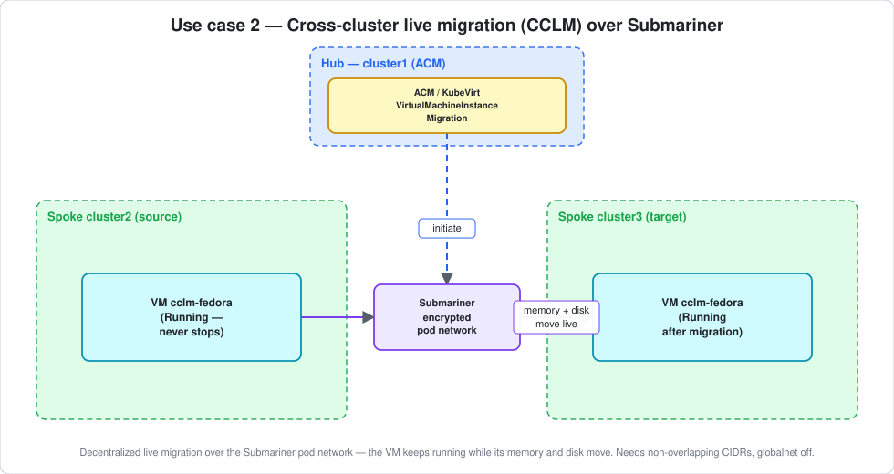

KubeVirt **decentralized live migration** moves a *running* VM from cluster2 to cluster3 with
no reboot. The VM's memory and disk stream directly between the two clusters' `virt-launcher`
pods, and a `virt-synchronization-controller` (TCP 9185, mTLS) coordinates the handoff. **All
of that traffic rides the Submariner pod network** — which is why the spokes must have
non-overlapping CIDRs and globalnet must be off (globalnet only routes exported Services, not
the ephemeral pod IPs the migration targets).

### ACM policies

**None for the migration itself** — CCLM is pure KubeVirt, and the second prerequisite (`cclm`, below)
patches each `HyperConverged` and cross-imports the KubeVirt CAs directly rather than through a policy.
From the first prerequisite (the common setup):

| Policy | Runs on | Does |
|--------|---------|------|
| `cnv-operator-policy` | spokes | Installs OpenShift Virtualization, whose `virt-synchronization-controller` performs the migration handoff |
| `metal-machineset-policy` | spokes | Creates the `m5.metal` MachineSet, since decentralized live migration needs a KVM-capable node on both ends |

### Prerequisite: enable CCLM on both spokes

```bash
./ansible-runner.sh cclm
```

This enables the `decentralizedLiveMigration` feature gate on each spoke's HyperConverged (on CNV
4.22 it is on by default; on CNV 4.21 the play sets it as an HCO featureGate), waits for the
`virt-synchronization-controller`, and cross-imports each spoke's KubeVirt CA into the other's
`kubevirt-external-ca` for the mTLS sync channel.

Verify Submariner connects the spokes with **no globalnet**:

```bash
oc --kubeconfig artifacts/cluster2/kubeconfig get submariner -n submariner-operator \
   -o jsonpath='globalCIDR="{.items[0].spec.globalCIDR}"{"\n"}'   # empty = globalnet OFF
oc --kubeconfig artifacts/cluster1/kubeconfig get managedclusteraddon -A | grep submariner
# cluster2 submariner  Available=True ;  cluster3 submariner  Available=True
```

### 1. Live-migrate a running VM from the ACM console

The default way to drive a cross-cluster live migration is the RHACM **Fleet management** console. It
is orchestrated by **MTV (Migration Toolkit for Virtualization)** via the `cnv-mtv-integrations`
component. The spokes must be registered as MTV **providers** — the `virt` play labels the managed
clusters `acm/cnv-operator-install=true` for this; without it the console reports "cross-cluster live
migration is not possible".

In **Fleet management → Search** (`kind:VirtualMachine`), each VM row exposes a **Cross cluster
migration** action:

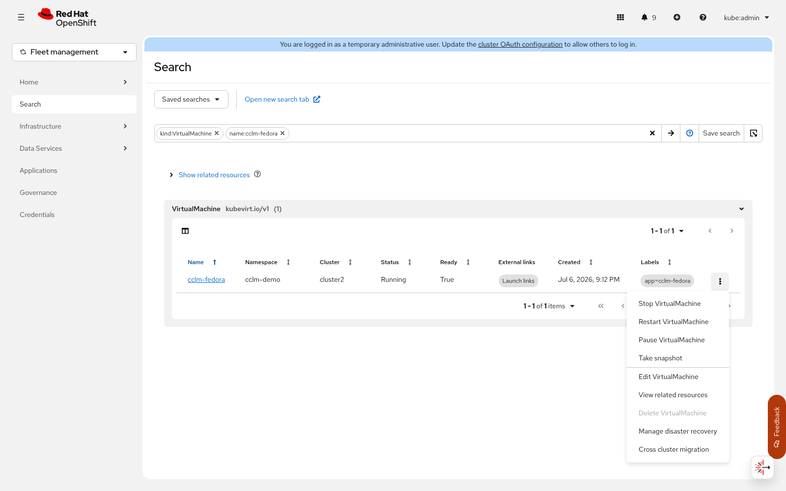

It opens the **Migrate VirtualMachines** wizard — pick the source/target cluster and project:

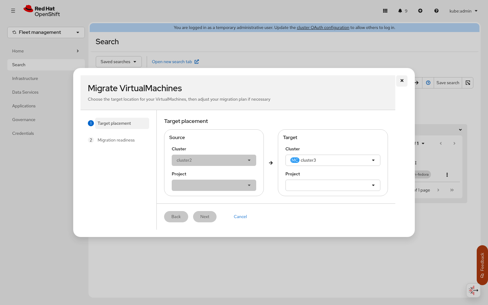

The **Migration readiness** step validates network mapping, storage mapping, and compute/version
compatibility, then creates and runs the MTV migration plan:

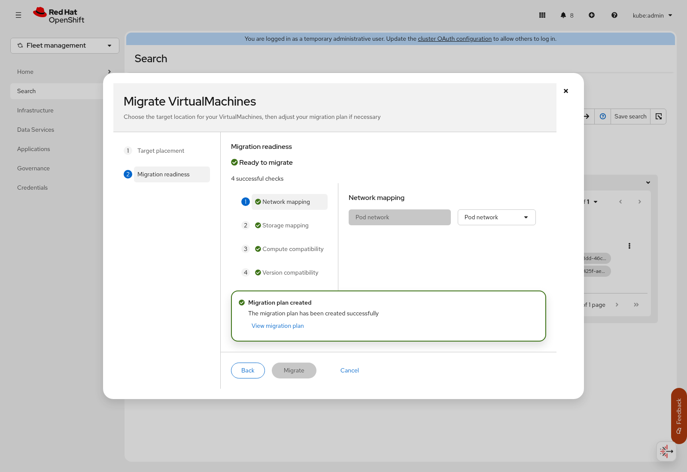

Under the hood the console builds an MTV `Plan`/`StorageMap`/`NetworkMap` (`type: live`) that performs
the same KubeVirt decentralized live migration as the CLI (same `:9185` sync channel): CDI
**populates** the receiver disk (`PrepareTarget`), then the live state sync runs (`Synchronization`).
A healthy run reaches `Initialize → PrepareTarget → Synchronization = Completed` with the target VMI
`Running`. ACM Search then shows the VM **Running on the target cluster**:


#### The receiver disk MUST be `volumeMode: Block`. Migration will fail otherwise.The automation makes `ocs-storagecluster-ceph-rbd-virtualization`
the **default virtualization StorageClass** on both spokes (`is-default-virt-class`, set by `infra-dr`),
and that class's `StorageProfile` defaults to **RWX / Block**. So VM disks are Block *and* the wizard's
`StorageMap` (which leaves `volumeMode` unset) inherits Block for the receiver — source and receiver are
byte-identical raw devices, and the migration completes.


> **To clear a hung/failed MTV migration:** delete the `plan`/`migration`/`storagemap`/`networkmap`
> in `mtv-integrations` and the leftover receiver `DataVolume` on the target spoke, then check the
> source VMI:
> ```bash
> oc --kubeconfig artifacts/cluster1/kubeconfig -n mtv-integrations delete migration,plan,storagemap,networkmap --all
> oc --kubeconfig artifacts/<target>/kubeconfig -n <ns> delete dv <vm>-disk   # removes the receiver PVC too
> oc --kubeconfig artifacts/<source>/kubeconfig -n <ns> get vmi <vm>          # expect Running; if Failed, delete it so the VM controller recreates it
> ```
> A Filesystem-receiver failure aborts *before* handoff, so the source VM keeps running; a failure
> mid-handoff can leave the source VMI `Failed` (the `runStrategy: Always` VM restarts it).

### Alternative: driving it from the CLI (`cclm-migrate`)

You can also drive the migration directly with KubeVirt CRs — **no ACM/MTV orchestration**. This is
lighter, leaves nothing to a wizard's storage mapping (it creates the receiver DataVolume without
forcing modes, so CDI inherits RWX Block from the `StorageProfile` automatically), and never disturbs
the source VM. Any running, PVC-backed VM works.

**1. Live-migrate cluster2 → cluster3** (demo VM `cclm-fedora` in `cclm-demo`):

```bash
./ansible-runner.sh cclm-migrate \
    -e cclm_vm=cclm-fedora -e cclm_from=cluster2 -e cclm_to=cluster3 -e cclm_vm_namespace=cclm-demo
```

Under the hood the play (`cclm-migrate.yml`):
1. Creates a receiver `VirtualMachine` (`runStrategy: WaitAsReceiver`) + blank DataVolumes on the target.
2. Creates a `receive` `VirtualMachineInstanceMigration` on the target and reads its
   `status.synchronizationAddresses[0]` — e.g. `10.132.0.32:9185`, a **raw cluster3 pod IP**
   reachable from cluster2 **only because Submariner routes the pod CIDR directly**.
3. Creates the matching `sendTo` migration on the source (`connectURL` = that address).
4. Waits for the target migration to reach `Succeeded`.

**2. Watch the VM move with zero downtime:**

```bash
watch 'echo cluster2:; oc --kubeconfig artifacts/cluster2/kubeconfig get vmi -n cclm-demo; \
       echo cluster3:; oc --kubeconfig artifacts/cluster3/kubeconfig get vmi -n cclm-demo'
# cluster3 VMI goes Scheduled → Running, then the cluster2 VMI disappears — the guest never rebooted.
```

**3. Migrate it back (bidirectional):**

```bash
./ansible-runner.sh cclm-migrate \
    -e cclm_vm=cclm-fedora -e cclm_from=cluster3 -e cclm_to=cluster2 -e cclm_vm_namespace=cclm-demo
```

ACM Search now shows the VM **Running on cluster2** again (the source side is left `Stopped`, as
decentralized migration intends):

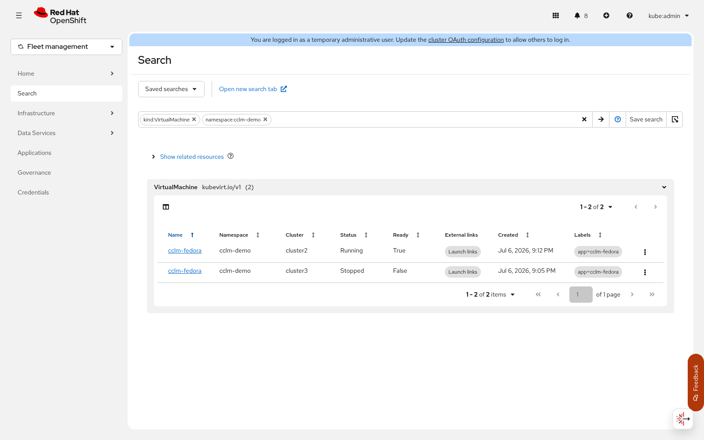

The OpenShift console on cluster2 shows the live VM:


> This is a **live** move: the guest keeps running throughout. It requires L3 pod-to-pod
> reachability between the clusters (here, Submariner over non-overlapping CIDRs) plus mutual
> KubeVirt-CA trust — the two `VirtualMachineInstanceMigration` objects drive it directly.

---

## Use case 3: Lightweight Regional/Asynchronous DR with VolSync (direct cluster-to-cluster) without the need for ODF

**Stand it up** — every command this use case needs, in order:

```bash
./ansible-runner.sh deploy       # cluster1/2/3 on AWS
./ansible-runner.sh operators    # ACM + ODF MCO (hub); DR-cluster + OADP (spokes)
./ansible-runner.sh import       # spokes into ACM as ManagedClusters
./ansible-runner.sh infra-dr     # Submariner (the rsync path) + ODF StorageCluster (the PVCs)
./ansible-runner.sh app          # for its GitOps wiring: GitOpsCluster + the acm-placement ConfigMap
./ansible-runner.sh virt         # VM variant only — metal nodes + OpenShift Virtualization
./ansible-runner.sh volsync-dr   # the app variant;  add --vm for the Fedora VM variant
```

`app` is needed even though this use case uses **no Ramen**: the workload is rendered by an
ApplicationSet, and without the `GitOpsCluster` and `acm-placement` ConfigMap that `app` creates, ACM
generates **no Argo Applications at all** (the console reports "There are no Argo applications
created"). Its MirrorPeer/DRPolicy side is simply unused here.


Use case 1 leans on the **full ODF Regional-DR stack** — the ODF Multicluster Orchestrator, Ramen, a
`MirrorPeer`, a `DRPolicy`, and a `DRPlacementControl` per app. This use case is the **lightweight
alternative**: DR driven by **VolSync alone**, syncing PVCs directly spoke-to-spoke over `rsync-tls` —
no Ramen, no MirrorPeer, no DRPC.

It protects **either an app or a VM — deploy one variant at a time**: the default is the app
(`mysql-pvc` in `quarkus-web-app-volsync`), and `volsync-dr --vm` swaps in the Fedora VM
`vm-dr-example` (its `vm-data-pvc` data disk in `vm-example-volsync`) driven by the `vm-vs-*` policy
twins. Both run in dedicated `*-volsync` namespaces so they coexist with use case 1.

The whole thing is orchestrated by **ACM policies keyed on one ManagedCluster label, `app-role`**:

- the **active** spoke (`app-role=active`) runs the workload + a VolSync `ReplicationSource` that pushes
  PVC snapshots to the standby;
- the **standby** spoke (`app-role!=active`) runs a `ReplicationDestination` that lands each sync as a
  `VolumeSnapshot`, ready to promote;
- **failover is a label flip on the hub** — GitOps re-renders the workload onto the new active spoke, and
  a six-policy engine swaps the Source/Destination roles automatically.

### ACM policies

Six, from [acm-policy-volsync-automate.yaml](acm-policy-volsync-automate.yaml) — or the `vm-`-prefixed
twins in [acm-policy-volsync-vm.yaml](acm-policy-volsync-vm.yaml) for the VM variant (deploy one or the
other, not both). All live in `open-cluster-management-global-set` and are placed by the `app-role` label:

| Policy | Runs on | Does |
|--------|---------|------|
| `vs-source-hub-views` | `local-cluster` | Keeps a `ManagedClusterView` of the `ReplicationDestination` on every non-active spoke, and prunes the views that no longer match a standby |
| `vs-dest-info-hub` | `local-cluster` | Distils those views into the `volsync-dest-info-*` ConfigMap holding the standby's rsync-tls address, key secret and storage classes |
| `vs-source-active` | `app-role=active` | Copies that ConfigMap down to the spoke and creates the `ReplicationSource` that pushes the PVC to the standby's address |
| `vs-dest-active-del` | `app-role=active` | Deletes the `ReplicationDestination` left over from when this spoke was the standby — but never while a sync reports `Synchronizing=True` |
| `vs-source-standby-del` | `app-role!=active` | Deletes the `ReplicationSource` left behind by the old active spoke, with the same mid-transfer guard |
| `vs-dest-standby` | `app-role!=active` | Creates the `ReplicationDestination` that lands each sync as a `VolumeSnapshot` on the destination PVC |

### How it works

- **rsync path:** a `ClusterIP` Service on the standby, **exported across the Submariner clusterset**
  (`<svc>.<ns>.svc.clusterset.local`) — no globalnet, no object store in the middle. Storage is ODF
  Ceph-RBD with `copyMethod: Snapshot`.
- The hub `volsync-dr-config` ConfigMap holds the storage classes + rsync address that the policies
  template into the live `ReplicationSource`/`ReplicationDestination`.

### 1. Deploy

```bash
./ansible-runner.sh volsync-dr                             # app; active = cluster2 (spoke_clusters[0])
./ansible-runner.sh volsync-dr -e volsync_active=cluster3  # or choose the active spoke
./ansible-runner.sh volsync-dr --vm                        # the Fedora VM variant (needs `virt`)
```

> ⚠️ **`--vm` needs virtualization nodes — run `./ansible-runner.sh virt` first.** It provisions the
> `m5.metal` MachineSet on each spoke and installs OpenShift Virtualization; without it the Fedora VM
> has no KVM-capable node to schedule on.

This labels the spokes active/standby, distributes the rsync-tls pre-shared key, applies the VolSync
policy engine, and renders the workload onto the active spoke via a GitOps ApplicationSet.


### 2. Verify replication

The `ReplicationSource` on the **active** spoke pushes on its schedule (that schedule *is* your RPO):

```bash
oc --kubeconfig artifacts/cluster2/kubeconfig get replicationsource -n quarkus-web-app-volsync
```

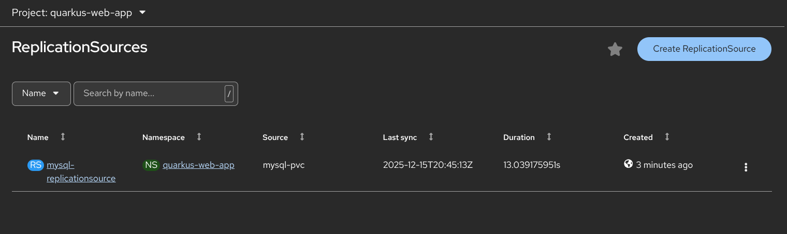

The `ReplicationDestination` on the **standby** receives it and holds the latest snapshot:

```bash
oc --kubeconfig artifacts/cluster3/kubeconfig get replicationdestination -n quarkus-web-app-volsync
```

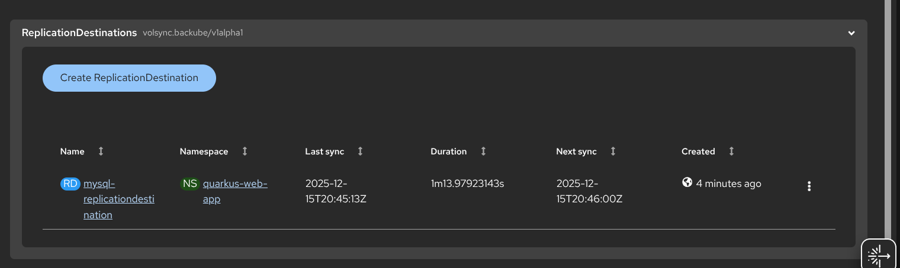

### 3. Fail over — flip the `app-role` label on the hub

No redeploy. Flip the two labels; GitOps moves the workload and the policies swap the VolSync roles:

```bash
oc --kubeconfig artifacts/cluster1/kubeconfig label managedcluster cluster3 app-role=active  --overwrite
oc --kubeconfig artifacts/cluster1/kubeconfig label managedcluster cluster2 app-role=standby --overwrite
```


The workload's ApplicationSet follows the `active` label — for the VM variant you can watch it migrate
spoke-to-spoke in the ACM Applications topology:


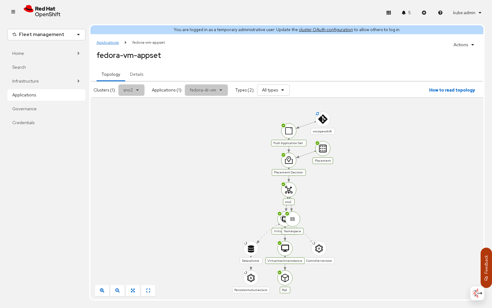

### 4. Verify the workload on the new active spoke

For the VM variant the Fedora VM comes up on the new active spoke, and its replicated data disk — a
heartbeat written to `/mnt/data` every minute — proves the sync survived the move:

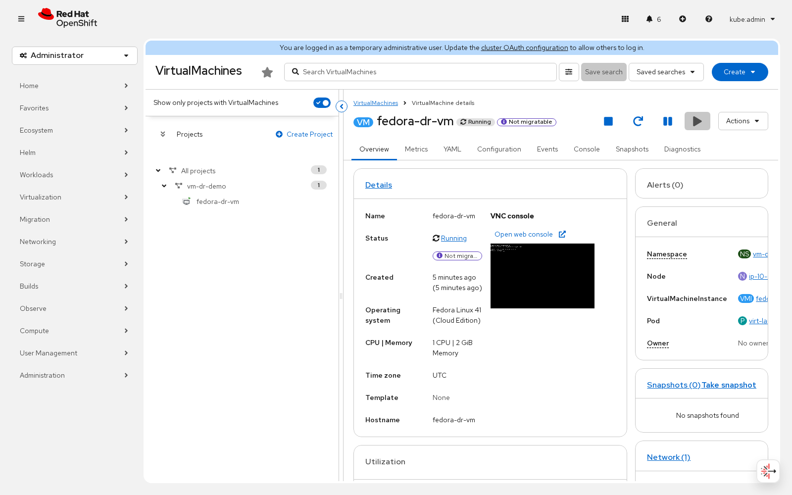
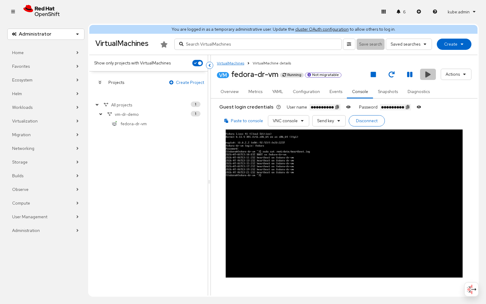

Tear it down with `./ansible-runner.sh volsync-dr --destroy` (add `--vm` for the VM variant).

> Compared to use case 1 this trades one-click, sub-second-RPO storage mirroring for a **simpler,
> storage-agnostic** replicate-and-restore DR: no ODF Regional-DR operators, coarser RTO
> (promote-from-snapshot), and RPO bounded by the sync schedule (`*/5 * * * *`). It still needs a network
> path for the rsync stream (Submariner here), but no Ramen — and because it lives in `*-volsync`
> namespaces, it runs alongside use case 1.

> 📸 The screenshots above were brought over from the reference implementation. The automation is written
> and syntax-checked but has not yet been re-run on these live clusters.

---

## Use case 4: OADP Backup & Recovery to object storage

**Stand it up** — every command this use case needs, in order:

```bash
./ansible-runner.sh deploy       # cluster1/2/3 on AWS
./ansible-runner.sh operators    # ACM (hub) + the OADP operator on both spokes
./ansible-runner.sh import       # spokes into ACM as ManagedClusters
./ansible-runner.sh infra-dr     # ODF StorageCluster — the VM disks bind ocs-storagecluster-ceph-rbd
./ansible-runner.sh virt         # metal nodes + OpenShift Virtualization on both spokes
./ansible-runner.sh oadp         # S3 bucket + DPA on the spokes, backup + failover policies on the hub
```

The auto-failover demo (steps 4-5) is self-contained: `oadp` deploys its own protected VM into
`vm-example-oadp`. The **manual** backup/restore walkthrough in steps 2-3 targets `vm-example`, which is
`virt`'s DR-protected VM — for that one, run `./ansible-runner.sh app` before `virt`, or point the
commands at another namespace with `-e oadp_backup_vm_namespace=…`.

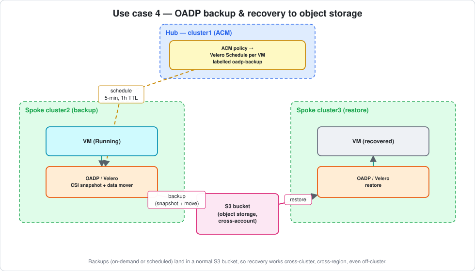

The DR use cases above keep a **continuously replicated** copy of the workload. **OADP** (OpenShift
API for Data Protection — Velero) is the **backup/restore** model instead: take a point-in-time backup
of a VM to an **S3 bucket**, then recover it on a *different* cluster whenever you need to. No Ramen,
no continuous replication, no direct cluster-to-cluster path — just a shared bucket both clusters can
reach. Good for on-demand migration, ransomware/oops recovery, long-term retention, and moving a VM to
a cluster that isn't a DR peer.

The OADP operator is installed on both spokes by the `operators` command. VM disks are `volumeMode:
Block`, so OADP uses **CSI snapshots + the data mover** (`snapshotMoveData`) — the kopia file-system
mover can't walk a raw block device — which copies the snapshot data into the bucket so it can be
rehydrated on the peer.

### ACM policies

Four, applied by `oadp` from [acm-policy-oadp-schedule.yaml](acm-policy-oadp-schedule.yaml) and
[acm-policy-oadp-autorestore.yaml](acm-policy-oadp-autorestore.yaml). The last three are keyed on the
dedicated `oadp-role: active/standby` ManagedCluster label — steps 4 and 5 below walk through them:

| Policy | Runs on | Does |
|--------|---------|------|
| `oadp-vm-backup-schedule` | both spokes | Creates a Velero `Schedule` (*/5, 1 h TTL) for every VM labelled `oadp-backup`, prunes it when the label goes, and inform-checks that backups are really being produced |
| `oadp-vm-autofailover-hub` | `local-cluster` | Watches the VM on each spoke through a `ManagedClusterView`, runs the grace-period timer, publishes the `oadp-dr-status` ConfigMap, and flips the `oadp-role` labels |
| `oadp-vm-restore-active` | `oadp-role=active` | Restores the newest `Completed`/`PartiallyFailed` backup when the VM is missing here and the hub says it is this spoke's turn, starts the VM, and un-pauses its `Schedule` |
| `oadp-vm-standby-cleanup` | `oadp-role=standby` | Pauses the local `Schedule` and, once the active site is confirmed running the VM, drops the stale copy and its PVCs (Velero will not re-hydrate an existing PVC) |

### 1. Provision the bucket + DataProtectionApplication

```bash
./ansible-runner.sh oadp
```

This creates one S3 bucket (`oadp-dr-<account-id>`, in the `oadp_aws_profile` account so both spokes
reach it with the same credentials), labels the ODF RBD `VolumeSnapshotClass` for Velero, and creates
a `DataProtectionApplication` on each spoke — plugins `openshift, aws, csi, kubevirt`, node agent
`kopia`, and a `BackupStorageLocation` pointed at the bucket (waits for `Available`). It also creates
the **scheduled-backup ACM policy** used in step 4.

### 2. Back up the VM on cluster2

```bash
./ansible-runner.sh oadp-backup -e oadp_from=cluster2 -e oadp_backup_vm_namespace=vm-example \
    -e oadp_backup_name=vm-backup
```

Creates a Velero `Backup` of the namespace with `snapshotMoveData: true` and waits for `Completed`:

```bash
oc --kubeconfig artifacts/cluster2/kubeconfig get backup vm-backup -n openshift-adp
# NAME        STATUS      ...
# vm-backup   Completed
```

### 3. Recover the VM on cluster3

```bash
./ansible-runner.sh oadp-restore -e oadp_to=cluster3 -e oadp_backup_name=vm-backup
```

Velero on cluster3 syncs the backup from the shared bucket, then a `Restore` rehydrates the VM's Block
PVCs from the moved snapshot data and recreates the VM:

```bash
oc --kubeconfig artifacts/cluster3/kubeconfig get restores.velero.io vm-backup-restore -n openshift-adp
oc --kubeconfig artifacts/cluster3/kubeconfig get vmi -n vm-example
```

> ✅ Steps 2–3 validated live 2026-07-27: backup `61/61` items + `DataUpload` of 10,447,089,664 bytes on
> cluster2, restore `Completed` on cluster3 with a matching `DataDownload` and the VM `Running`.
>
> ⚠️ Always use the **fully-qualified** `backups.velero.io` / `restores.velero.io`. The short name
> `backup` is ambiguous and the winner changes as you install use cases — with ODF it can resolve to
> `backups.postgresql.cnpg.noobaa.io`, and once **use case 5** installs CNPG it resolves to
> `backups.postgresql.cnpg.io`. That is not just a console annoyance: it silently broke these two
> playbooks, which reported "not found" for a backup that existed and had completed.
>
> ⚠️ A backup of a *running* VM ends **`PartiallyFailed`**, not `Completed` — OADP's KubeVirt freeze
> hook fails without a guest agent while the disk data is still fully moved to S3. It is restorable,
> and anything that waits for `Completed` alone will never restore a VM backup.

### 4. Automatic scheduled backups by label (ACM policy)

`oadp-backup` above is a one-shot. `oadp` also creates an **ACM policy** (`oadp-vm-backup-schedule`,
enforced on the spokes) that turns backups into a **label-driven cron**: label any VM and the policy
creates a Velero **`Schedule`** — the OADP-native "backup cronjob" — that backs that VM's namespace up
**every 5 minutes** with a **1-hour TTL**, to the same bucket. Remove the label and the `Schedule` is
pruned (`pruneObjectBehavior: DeleteIfCreated`); a second, inform-only policy **confirms backups are
being produced**.

The example VM `vm-dr-example` (from `virt`) runs on the active spoke, backed by the `dr-s3`
`BackupStorageLocation` that `oadp` made **Available**:

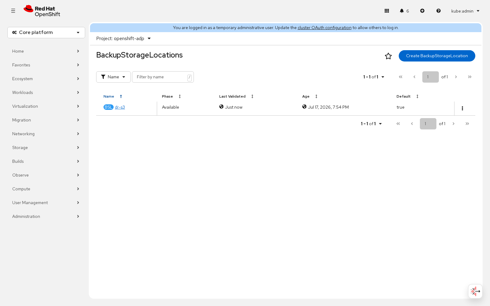
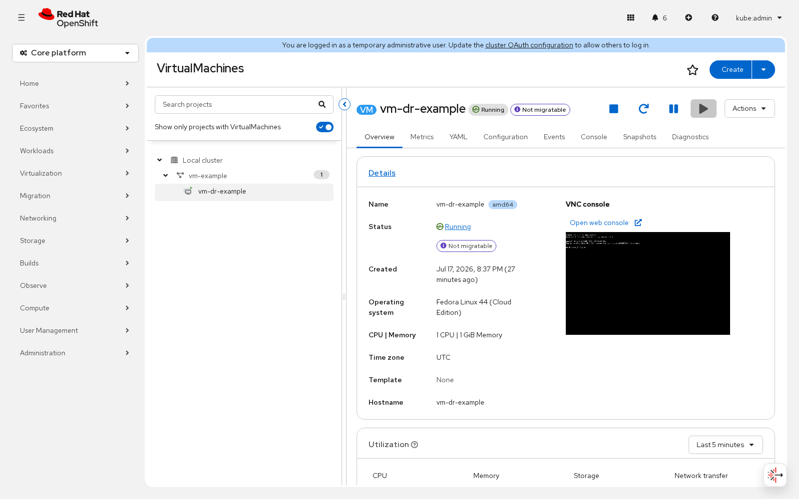

Enable scheduled backups for the VM — just label it:

```bash
# on cluster2 (the active spoke)
oc --kubeconfig artifacts/cluster2/kubeconfig label vm vm-dr-example -n vm-example oadp-backup=true --overwrite
```

Within a minute the policy reconciles a Velero `Schedule` for that VM (`*/5`, 1h TTL):

```bash
oc --kubeconfig artifacts/cluster2/kubeconfig get schedule -n openshift-adp
# NAME                             STATUS    SCHEDULE      LASTBACKUP
# vm-dr-example-scheduled-backup   Enabled   */5 * * * *   ...
```

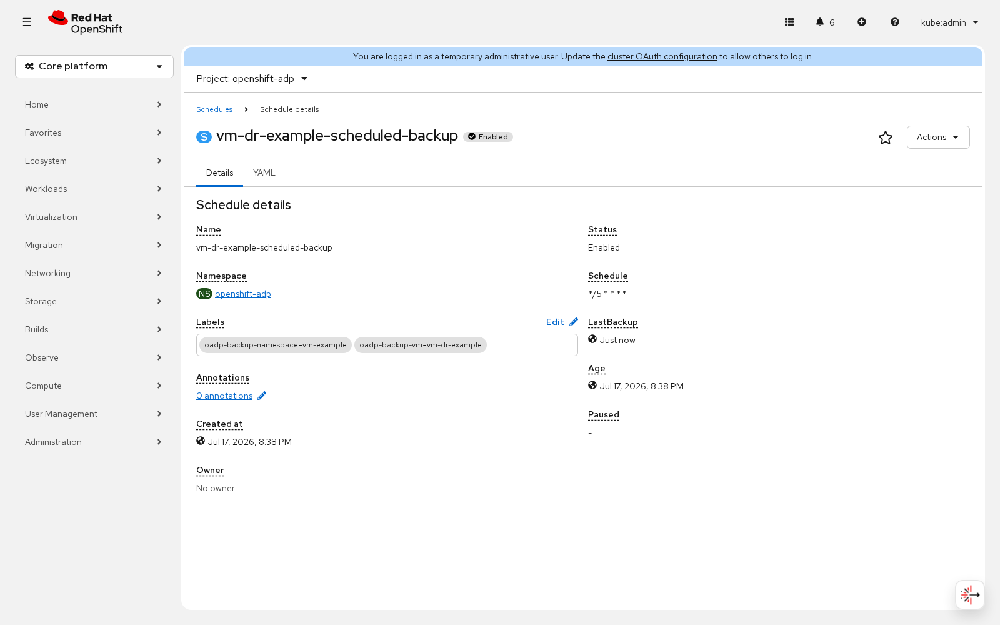

Confirm the backups accumulate — with `*/5` + a 1h TTL, steady state is ~12 live backups (older ones
auto-expire). ⚠️ Use the **fully-qualified `backups.velero.io`**: the short name `backup` collides with
another CRD (`backups.postgresql.cnpg.noobaa.io`) and silently returns nothing.

```bash
oc --kubeconfig artifacts/cluster2/kubeconfig get backups.velero.io -n openshift-adp \
   -l velero.io/schedule-name=vm-dr-example-scheduled-backup
```

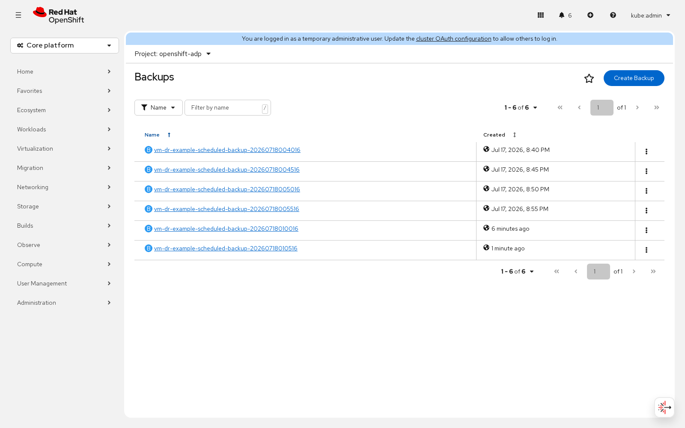

The `oadp-vm-backup-schedule` policy reports **Compliant** across the spokes in ACM Governance:

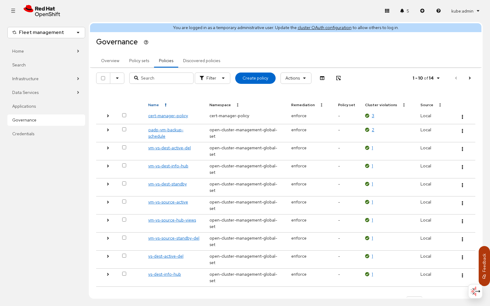

Stop and prune the schedule by removing the label:

```bash
oc --kubeconfig artifacts/cluster2/kubeconfig label vm vm-dr-example -n vm-example oadp-backup- --overwrite
```

### 5. Automatic failover and failback (ACM policy)

Steps 2 and 3 are a manual backup and a manual restore. `oadp` also creates
[`acm-policy-oadp-autorestore.yaml`](acm-policy-oadp-autorestore.yaml), which closes the loop: **if the
VM stops being available on the active spoke for 30 seconds, the peer restores it from the newest
backup in the bucket** — and then starts taking the scheduled backups itself, so the same machinery
works in the other direction.

It runs on **its own copy of the VM**, in the `vm-example-oadp` namespace ([`vm-app-oadp/`](vm-app-oadp/),
deployed straight to the active spoke by `oadp` — no GitOps). That separation is deliberate, and the
same one use case 3 makes with `vm-example-volsync`: `vm-example` is DR-protected by Ramen and kept in
sync by ArgoCD, so an OADP failover there would be undone by GitOps and would fight Ramen over the same
PVCs. The VM ships pre-labelled `oadp-backup=true`, so the schedule policy from step 4 starts backing
it up as soon as it lands — on whichever spoke it lands on.

The whole control plane is **one label on the ManagedCluster** (its own label, independent of use
case 3's `app-role` and use case 5's `pg-role`):

```
oadp-role: active     the spoke that should be running the VM
oadp-role: standby    the peer - holds no copy, the copy of record is the S3 bucket
```

`oadp` seeds the labels (cluster2 active, cluster3 standby) the first time only, so re-running it
never drags the role back after a failover. Three policies split the work:

| Policy | Runs on | Does |
|--------|---------|------|
| `oadp-vm-autofailover-hub` | `local-cluster` | Watches the VM on both spokes through a `ManagedClusterView`, runs the grace-period timer, publishes the `oadp-dr-status` ConfigMap, and flips the `oadp-role` labels |
| `oadp-vm-restore-active` | `oadp-role=active` | Restores the newest `Completed` backup when the VM is missing here and the hub says it is this cluster's turn, powers a freshly restored VM on, un-pauses its `Schedule` |
| `oadp-vm-standby-cleanup` | `oadp-role=standby` | Pauses the local `Schedule`, and once the active site is confirmed running the VM, drops the stale local copy (the VM and the PVCs that VM uses) |

The 30-second dwell is a `Pod` on the hub that runs `sleep 30`: created when the VM goes missing,
deleted the moment it comes back, "elapsed" = the Pod reaching `Succeeded`. That keeps the countdown
in the cluster and makes it something you can watch. (A `Job` is the obvious choice and was the first
implementation — but deleting a `batch/v1` Job orphans its pods, and a ConfigurationPolicy can only
delete what it can *name*: a nameless `mustnothave` matched on labels is reported as a violation and
never acted on, so the orphans pinned the policy `NonCompliant` forever. A named Pod is created and
deleted cleanly.)

**Trigger a failover** — delete the VM on the active spoke (stopping it works too):

```bash
oc --kubeconfig artifacts/cluster2/kubeconfig delete vm vm-dr-example -n vm-example-oadp
```

**Watch it happen** from the hub:

```bash
# the countdown
oc --kubeconfig artifacts/cluster1/kubeconfig -n open-cluster-management-global-set get pod oadp-failover-timer

# the state machine
oc --kubeconfig artifacts/cluster1/kubeconfig -n open-cluster-management-global-set \
   get cm oadp-dr-status -o jsonpath='{.data}' | tr ',' '\n'

# the role flip
oc --kubeconfig artifacts/cluster1/kubeconfig get managedcluster -L oadp-role
```

Measured on the live three-cluster environment, from `delete vm` to the VM Running on the peer:

| T+ | Event |
|----|-------|
| 18 s | VM gone; hub sees `vmAvailable=false` |
| 32 s | Timer Pod created |
| 69 s | Timer Pod `Succeeded` — the 30 s dwell has elapsed |
| 77 s | **`oadp-role` flips: cluster2 → standby, cluster3 → active** |
| 92 s | cluster3 creates a `Restore` from the newest backup; timer Pod removed |
| 225 s | **Restore `Completed`, VM `Running` on cluster3** |

So the role moves in ~75 s (30 s dwell + detection/evaluation) and the VM is back in ~4 min, the bulk
of it the data mover pulling the 10 GB disk back out of S3:

```bash
oc --kubeconfig artifacts/cluster3/kubeconfig -n openshift-adp get restores.velero.io
oc --kubeconfig artifacts/cluster3/kubeconfig -n vm-example-oadp get vm,vmi
# the restored VM still carries the oadp-backup label, so the schedule policy
# creates its Schedule here and backups continue from cluster3
oc --kubeconfig artifacts/cluster3/kubeconfig -n openshift-adp get schedules.velero.io
```

**Fail back** by flipping the labels back — that is the whole failback procedure:

```bash
oc --kubeconfig artifacts/cluster1/kubeconfig label managedcluster cluster2 oadp-role=active  --overwrite
oc --kubeconfig artifacts/cluster1/kubeconfig label managedcluster cluster3 oadp-role=standby --overwrite
```

cluster2 restores the newest backup (taken on cluster3) and starts the VM; cluster3 pauses its
schedule and — once cluster2's VM is confirmed up — drops its now-stale copy. The stale copy has to
go, because Velero will **not** re-hydrate a PVC that already exists, so a leftover `vm-data-pvc`
would silently be reused with old data the next time that cluster took over.

Four guards keep it from oscillating, all visible in `oadp-dr-status`:

| Guard | Effect |
|-------|--------|
| `vmEverSeen` | Never fails over a VM that was never created — the policy is inert until it has seen the VM up once |
| `autoFailoverDone` | One automatic flip per outage; cleared only when the VM is up again on the active site, so the new site can restore in peace |
| `standbyHasVM` | The peer still holding the VM means a manual failback is in flight, not an outage. The standby must therefore keep its copy until the new active site is genuinely up — and must check `activeSite` names *someone else* before believing `vmAvailable`, since that field still describes the old active for one cycle after a flip |
| `standbyClusterAvailable` | Never hands the role to an unreachable cluster |

> **Scope and caveats.** Losing the *whole* cluster (rather than the VM) is only detected once ACM
> marks the ManagedCluster unavailable, which takes ~5 minutes of missed leases — the VM-level signal
> is the fast path. RPO is still the backup interval (5 minutes), so a failover loses up to the last
> 5 minutes of writes. Auto-failover assumes it is the **only** DR engine for that namespace: do not
> point it at a VM that use case 1 (Ramen) is also protecting, or set
> `oadp_standby_cleanup: false` so the standby copy is left alone. Tunables live in
> `inventory/group_vars/all.yml` (`oadp_failover_grace_seconds`, `oadp_dr_vm_name`,
> `oadp_autorestore_enabled`, `oadp_standby_cleanup`) and are pushed to the hub `oadp-dr-config`
> ConfigMap, which the policies re-read live.

> ✅ **Validated live on the three-cluster environment**, in both directions and repeatedly: the VM was
> deleted on the active spoke and came back Running on the peer in ~4 min with no human input, then was
> failed back with a label flip, then failed over again. All four policies report `Compliant` in ACM
> Governance in steady state. The 10 GB data disk round-tripped byte-for-byte through S3 — the
> `DataUpload` on the source and the `DataDownload` on the target both report exactly
> `10,447,089,664` bytes.
>
> Three defects only the live run could surface, all now fixed:
> 1. **Orphaned PVCs were never cleaned up.** The standby cleanup was gated on a stale *VM* still
>    existing, but a failover triggered by deleting the VM leaves no VM and an orphaned PVC — and
>    Velero will not re-hydrate a PVC that already exists, so the next failback would have silently
>    reused a stale disk. Cleanup now covers the VM namespace's PVCs whether or not the VM object
>    is still there.
> 2. **The new active site backed up a half-restored disk.** Its `Schedule` is created as soon as the
>    VM *object* lands, which is minutes before the data mover finishes rehydrating the PVC — so it
>    fired mid-restore and produced a backup of a partially-written disk that was *newer* than the
>    good one, and therefore the one a subsequent failover would pick. The schedule now stays paused
>    until the VM reports ready.
> 3. **A real ping-pong on failback.** Right after a role flip the placement moves this policy to the
>    new standby a cycle *before* the hub rewrites `oadp-dr-status`, so for one evaluation the standby
>    read `vmAvailable=true` — a statement about its *own* VM — and deleted its running copy. That
>    removed the `standbyHasVM` guard, the hub armed a failover, and the role flipped straight back.
>    The cleanup now also requires `activeSite` to name a *different* cluster. Re-tested after the fix:
>    the old site keeps the VM running for 225 s of a 232 s failback, handing over only once the new
>    site is confirmed up.

> **Consistency:** OADP attempts a KubeVirt guest **freeze** (via the QEMU guest agent) before each
> backup. If the agent isn't ready the freeze hook fails and Velero marks the backup `PartiallyFailed` —
> the disk data is still moved to S3, but the copy is **crash-consistent** rather than quiesced. For
> guaranteed application consistency, ensure the guest agent is running (or power the VM off) before backing up.

> ✅ The screenshots above were captured on the live three-cluster environment: `vm-dr-example` running on
> a bare-metal spoke, the label-created `Schedule`, backups landing every 5 minutes via the data mover,
> and the policy Compliant in ACM.

> This is **backup/restore**, not replication: RPO is *when you last ran the backup* and RTO is the
> restore time (data is copied out of the bucket). For a running VM the disk backup is crash-consistent;
> for application consistency, quiesce/freeze the guest (or power the VM off) before backing up. The
> bucket is a normal S3 bucket, so backups also work cross-account, cross-region, and off-cluster.

---

## Use case 5: CNPG cross-site Postgres over Red Hat Service Interconnect

**Stand it up** — every command this use case needs, in order:

```bash
./ansible-runner.sh deploy       # cluster1/2/3 on AWS
./ansible-runner.sh operators    # ACM on the hub (this use case installs RHSI + CNPG itself)
./ansible-runner.sh import       # spokes into ACM as ManagedClusters
./ansible-runner.sh infra-dr     # ODF StorageCluster (the Postgres PVCs) + the dr-clusters clusterset
./ansible-runner.sh rhsi         # RHSI + CNPG operators, Site/Link, the CNPG Cluster and the policies
```

The shortest chain of the five: **no `virt`** (no VMs), **no `app`** (no GitOps, no Ramen) and **no
Submariner** — RHSI carries the traffic over its own mTLS VAN, so `infra-dr` is needed only for ODF
storage and the `dr-clusters` ManagedClusterSet the policy Placements select.

The other DR use cases move a *VM* between clusters. This one keeps a **database** live on **both** spokes:
a [CloudNativePG](https://cloudnative-pg.io) (CNPG) **primary** on one spoke streaming to a **replica** on
the other, with **Red Hat Service Interconnect** (RHSI, the productized [Skupper](https://skupper.io) v2,
`skupper.io/v2alpha1`) carrying the streaming replication *and* the app's write path over a layer-7 mTLS
**Virtual Application Network (VAN)** — no Submariner, no shared pod CIDRs, no VPN. Failover is an ACM
`pg-role` label-flip that drives a **zero-data-loss CNPG controlled switchover**: which side is read/write
moves to the other cluster, and the RHSI write path follows.

> ✅ **Validated live 2026-07-27** on the three-cluster environment. Skupper Sites Ready on both
> spokes with an mTLS Link between them; CNPG bootstrapped a primary on cluster2 and a streaming
> replica on cluster3 **over the VAN** (`pg_stat_replication` shows `streaming/async` with the local
> Skupper router as `client_addr`); a row written on the primary read back on the replica. Flipping
> `pg-role` then performed a real controlled switchover — cluster2 went to `pg_is_in_recovery=t` and
> cluster3 to `f`, the pre-switchover row survived (zero data loss), a new write on cluster3
> replicated **back** to cluster2, and the `pg-write` Connector moved so the write path followed.
>
> Five defects were found and fixed in the process — see the "Gotchas found live" note at the end of
> this section. None were visible to YAML/template validation; every one needed a live operator.

> ✅ **Re-validated 2026-07-30** after a **sixth** defect was found: the switchover used to deadlock
> with **both sites left as replicas and no writable database anywhere**, indefinitely. Replication
> dialled the shared `pg-write` key, but during handover both pods still carry
> `cnpg.io/instanceRole=primary`, so the promoting site's own Connector matched its own replica and
> Skupper's local-preference made it **stream from itself** — `receive_lsn` frozen short of the
> promotion token's LSN, token never verified. `pg_stat_wal_receiver` reported `streaming` throughout,
> so every status field looked healthy. Replication now uses **site-scoped keys** (`pg-site-<site>`,
> one Connector per site, role-agnostic selector), so there is no local target to shadow the peer and
> the deadlock is impossible by construction.
>
> Measured on the rebuilt environment with all five use cases running side by side: **switchover
> completed unaided in 50 s** (label flip and nothing else), the pre-switchover row survived, a fresh
> write on the new primary replicated **back** to the demoted site, and the `pg-write` Connector
> followed. That last check is the one that matters — it distinguishes a real controlled switchover
> from replication merely stopping.

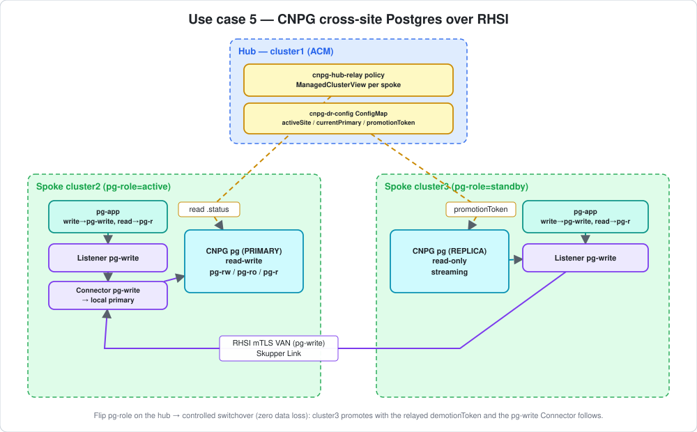

### How it works

`./ansible-runner.sh rhsi` installs the operators, builds the fabric, and hands the steady state to an
ACM policy engine:

1. **RHSI operators** on each spoke **for all namespaces** (`skupper-operator` + the Network Observer),
   into `openshift-operators` (AllNamespaces scope, asserted, not assumed).
2. **CloudNativePG operator** on each spoke (community `cloudnative-pg`; distributed topology needs
   CNPG ≥ 1.24).
3. **Site + Link** — a Skupper `Site` (`linkAccess: default`) in `postgres-dr` on each spoke; an
   `AccessGrant` on the first spoke is redeemed by an `AccessToken` on the second to form the mTLS `Link`.
4. **Shared certs** — a CA + a `streaming_replica` client cert are generated once and side-loaded to
   **both** spokes, so replication TLS works in **both** directions across switchovers. Streaming uses
   `sslmode: verify-ca` (not `verify-full`): the replica dials the Skupper Listener DNS name `pg-write`,
   which isn't in the server-cert SAN.
5. **ACM policy engine** keyed on the `pg-role` ManagedCluster label — the three policies below.

The single cross-VAN routing key is **`pg-write`**. There is a `pg-write` Listener on **both** sites, so
the app (and the replica's streaming) always dial `pg-write:5432` locally: Skupper's local-preference
serves the active site's own primary, otherwise it crosses the Link to the current primary. **Reads never
cross the VAN** — the app reads its local `pg-r` service.

### ACM policies

Three, rendered from [templates/rhsi-cnpg-policy.yaml.j2](templates/rhsi-cnpg-policy.yaml.j2) and placed
by the dedicated `pg-role: active/standby` label (independent of use case 3's `app-role`):

| Policy | Runs on | Does |
|--------|---------|------|
| `cnpg-fabric` | both spokes | Creates the CNPG `Cluster pg` in distributed topology — a hub template reads which spoke is `pg-role=active` and sets `spec.replica.primary`/`source` — plus the `pg-write` Skupper Listener; never pruned, since it owns the data |
| `cnpg-connector` | `pg-role=active` | Publishes the local primary under the `pg-write` routing key; pruned when the label flips, so the write path follows the new primary |
| `cnpg-hub-relay` | `local-cluster` | Runs a `ManagedClusterView` over each spoke's CNPG Cluster and aggregates `activeSite`/`currentPrimary`/`promotionToken` into the `cnpg-dr-config` ConfigMap, carrying the `demotionToken` old primary → new |

### 1. Build it

```bash
./ansible-runner.sh rhsi
```

The primary lands on cluster2, the replica on cluster3, streaming over the Link:

```bash
oc --kubeconfig artifacts/cluster2/kubeconfig get cluster pg -n postgres-dr
# NAME   INSTANCES   READY   STATUS                     PRIMARY
# pg     1           1       Cluster in healthy state   pg-1
oc --kubeconfig artifacts/cluster3/kubeconfig get cluster pg -n postgres-dr
# NAME   INSTANCES   READY   STATUS                              PRIMARY
# pg     1           1       Cluster in healthy state (replica)  pg-1

oc --kubeconfig artifacts/cluster2/kubeconfig get connector,listener -n postgres-dr
# connector.skupper.io/pg-write   pg-write   5432   cnpg.io/cluster=pg,...=primary   Ready   true   OK
# listener.skupper.io/pg-write    pg-write   5432   pg-write                         Ready   true   OK
# (cluster3 has the Listener only — no Connector, since it is the replica)
```

### 2. Watch the app (writes follow the primary, reads stay local)

The sample `pg-app` runs on both spokes. It writes a heartbeat via `pg-write` (the VAN key → current
primary) and reads its local endpoint, printing `local_is_replica=<t|f>` so each site's role is visible:

```bash
oc --kubeconfig artifacts/cluster2/kubeconfig logs -f deploy/pg-app -n postgres-dr
# [read]  local_is_replica=f          <- cluster2 is read-write (primary)
# [read]  id | site     | ts ...      <- rows written from BOTH sites are readable here
oc --kubeconfig artifacts/cluster3/kubeconfig logs -f deploy/pg-app -n postgres-dr
# [read]  local_is_replica=t          <- cluster3 is read-only (replica), yet has the data (streamed over the VAN)
```

Every write — including cluster3's, which crosses the Link to cluster2's primary — lands on the one
primary and replicates back, so both sites' local reads converge.

### 3. Fail over: flip the label, read/write moves

```bash
oc --kubeconfig artifacts/cluster1/kubeconfig label managedcluster cluster3 pg-role=active  --overwrite
oc --kubeconfig artifacts/cluster1/kubeconfig label managedcluster cluster2 pg-role=standby --overwrite
```

The hub relay carries cluster2's `demotionToken` to cluster3, which promotes **with** the token (a
controlled switchover — **zero data loss**, not a forced failover). The `pg-write` Connector is pruned on
cluster2 and re-created on cluster3, so writes now land there. The app logs flip: `local_is_replica` is
now `f` on cluster3 and `t` on cluster2, and the heartbeat sequence is unbroken.

If the declarative token relay stalls, promote by hand:

```bash
oc --kubeconfig artifacts/cluster3/kubeconfig cnpg promote pg -n postgres-dr
```

Tear it all down with `./ansible-runner.sh rhsi --destroy` (removes the CNPG Cluster and its data, the
RHSI fabric, the ACM policies, and the operators; the shared `open-cluster-management-global-set` policy
namespace and the `dr-clusters` clusterset are left intact).

> **Two site DR has no free lunch.** RHSI carries the connection, but the *state* is one-way replicated:
> reads are active/active, writes go to the single primary, and a controlled switchover has a small
> convergence window. True multi-master strong consistency across exactly two sites would need a third
> witness. See the notes in `CLAUDE.md`.


### Gotchas found live

Everything below was discovered by running this use case on real clusters; each one is fixed in the
repo. They are recorded because none of them are visible to YAML linting or template rendering — the
policy engine happily produces output that the target operator then rejects.

| # | Symptom | Cause / fix |
|---|---------|-------------|
| 1 | CNPG CSV never appears | `cloudnative-pg` ships in the **Certified** catalog, not Community. `cnpg_catalog_source` corrected. |
| 2 | `cnpg-fabric` NonCompliant, and the CNPG `Cluster` is simply never created on the spokes | A **hub template may not list cluster-scoped resources** — `lookup … "ManagedCluster" "" ""` fails with *"lookup of cluster-scoped resource 'ManagedCluster/' is not allowed"*, and a hub template that fails to render means ACM **never creates that ConfigurationPolicy at all**. The error is only visible in the *replicated* policy's status in the cluster namespace. Now reads `activeSite` from the `cnpg-dr-config` ConfigMap (a namespaced lookup, which is allowed). The same lookup is fine in `cnpg-hub-relay` — that one runs as an ordinary managed-cluster template on `local-cluster`. |
| 3 | `mcluster.cnpg.io` webhook rejects the Cluster | `spec.externalClusters[].connectionParameters` is `map[string]string`, so the port must be **quoted**. Note the Skupper Listener/Connector ports in the same file must stay bare ints — opposite rules, same template. |
| 4 | `Unable to create required cluster objects`, `generating server TLS certificate: invalid private key PEM block type` | CNPG parses a bring-your-own CA with `ParseECPrivateKey`, which accepts **only** `BEGIN EC PRIVATE KEY` (SEC1). The playbook's RSA/PKCS#8 CA was perfectly valid and still unusable. Now `openssl ecparam -name prime256v1 -genkey -noout` — note `openssl genpkey -algorithm EC` emits PKCS#8 and fails identically, so "use an EC key" is not enough on its own. |
| 5 | Label flip moves the write path but the database roles never swap | **`spec.bootstrap` is immutable in CNPG.** The template rendered it from the current role (`initdb` vs `pg_basebackup`), so every switchover tried to rewrite it and the API rejected the *whole* update — including the `replica.primary` change that triggers demotion. The switchover deadlocked with *"cannot be updated, likely due to immutable fields not matching"*. `bootstrap` is now keyed on the **site**, so the rendered spec is identical before and after a flip and only the mutable fields change. |

One more, in the playbook rather than the policy: `rhsi` used to re-apply the `pg-role` labels on **every**
run, which silently reverted an in-progress switchover back to the original site. The roles are now
seeded once and then left to whoever flips them.

---

## Command reference

| Command | Purpose |
|---------|---------|
| `./ansible-runner.sh deploy` | Install cluster(s) on AWS (IPI, OpenShift 4.22.5) |
| `./ansible-runner.sh destroy --yes` | Tear down cluster(s) |
| `./ansible-runner.sh operators` | ACM + ODF MCO + Ramen (hub); DR-cluster + OADP (spokes) |
| `./ansible-runner.sh import` | Import spokes into ACM |
| `./ansible-runner.sh infra-dr` | Submariner (globalnet off) + ODF StorageCluster |
| `./ansible-runner.sh certs` | cert-manager + Let's Encrypt wildcard certs |
| `./ansible-runner.sh app` | MirrorPeer + DRPolicy + sample DR app (GitOps instance by default; `-e app_deployment_mode=direct\|both`) |
| `./ansible-runner.sh virt` | OpenShift Virtualization + DR-protected VM |
| `./ansible-runner.sh volsync-dr` | VolSync Direct DR (app-role label-flip failover) for the app; `--vm` for the VM — the `--vm` variant needs `virt` run first (use case 3) |
| `./ansible-runner.sh volsync-dr --destroy` | Tear down VolSync Direct DR (`--vm` for the VM variant) |
| `./ansible-runner.sh cclm` | Enable cross-cluster live migration on the spokes |
| `./ansible-runner.sh cclm-migrate -e cclm_vm=… -e cclm_from=… -e cclm_to=…` | Live-migrate a VM between spokes |
| `./ansible-runner.sh oadp` | OADP: S3 bucket + DataProtectionApplication on spokes, scheduled-backup + auto-failover policies on the hub (use case 4) |
| `./ansible-runner.sh oadp-backup -e oadp_from=cluster2` | Back up a VM namespace to the bucket |
| `./ansible-runner.sh oadp-restore -e oadp_to=cluster3 -e oadp_backup_name=vm-backup` | Restore the VM on the peer |
| `./ansible-runner.sh oadp --destroy` | Remove the OADP policies, DPA, Velero Schedules/Backups and the protected VM — **keeps the S3 bucket** (add `-e oadp_remove_bucket=true` to delete it) |
| `./ansible-runner.sh rhsi` | CNPG cross-site Postgres over Red Hat Service Interconnect; `pg-role` label-flip switchover (use case 5) |
| `./ansible-runner.sh rhsi --destroy` | Remove the CNPG Cluster, RHSI Link/Sites, ACM policies, and operators |
| `./ansible-runner.sh validate` / `list` / `shell` | Validate config / list clusters / debug shell |

Add `--destroy` to `operators`, `infra-dr`, `certs`, `app`, `virt`, `cclm`, `volsync-dr`, `oadp` or
`rhsi` to remove what they created.

### Returning to a clean environment

Tear the use cases down in reverse build order, then the common setup:

```bash
./ansible-runner.sh volsync-dr --destroy     # use case 3 (add --vm for the VM variant)
./ansible-runner.sh rhsi --destroy           # use case 5
./ansible-runner.sh oadp --destroy           # use case 4  (-e oadp_remove_bucket=true drops the bucket)
./ansible-runner.sh cclm --destroy           # use case 2 (leaves CNV installed)
./ansible-runner.sh virt --destroy           # CNV + metal MachineSets + the DR VM
./ansible-runner.sh app --destroy
./ansible-runner.sh infra-dr --destroy       # Submariner + ODF + MirrorPeer
./ansible-runner.sh certs --destroy
./ansible-runner.sh import --destroy         # detach the spokes from ACM
./ansible-runner.sh operators --destroy      # includes the OADP operator + openshift-adp
```

To scrap the whole environment instead, `./ansible-runner.sh destroy --yes` deletes the clusters
(and their Route53 records and imported EC2 key pairs). Three things live outside the clusters and
survive it: the **OADP S3 bucket** (`oadp --destroy -e oadp_remove_bucket=true`, or `aws s3 rb`),
the **podman images** the runner rebuilds on every command (`podman image prune -f` — dangling only,
never `-a`), and the local **`artifacts/`** directory (kubeconfigs, install dirs, CNPG certs).

## Key configuration

- `inventory/group_vars/all.yml` — OpenShift version (`4.22.5`), operator channels
  (ACM `release-2.17`, ODF `stable-4.21`), `globalnet_enabled: false`.
- `inventory/host_vars/cluster{1,2,3}` — per-cluster `aws_profile`, region, and the
  **non-overlapping** `cluster_network_cidr` / `service_network_cidr` / `machine_network_cidr`
  that make Submariner-without-globalnet (and therefore CCLM) possible.

## Notes / gotchas

- **Non-overlapping CIDRs are load-bearing for use case 2.** If the spokes share CIDRs you must
  run Submariner with globalnet, and CCLM's pod-to-pod data path will not route. Changing CIDRs
  means reinstalling the spoke.
- **`certs` before Regional-DR replication.** Let's Encrypt certs on the S3 routes are what let
  Ramen validate the `DRCluster`s over TLS.
- **ODF Multicluster Orchestrator needs GitOps.** On the hub, the ArgoCD (`argoproj.io`) CRDs
  must exist before the ODF MCO subscription, or `odfmo-controller-manager` crash-loops; the
  `operators` play installs OpenShift GitOps first for this reason.
- Inspired by [sno-disaster-recovery](https://github.com/MoOyeg/sno-disaster-recovery).
